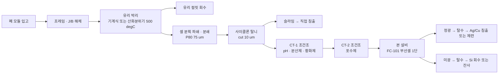

# 태양광 패널 재활용용 단단(1-stage) 부유선별기 설계

**목적** — 폐 태양광 모듈(c-Si)에서 회수된 셀 분획으로부터 **은(Ag)** 과 **구리(Cu)** 를
부유선별로 농축한다.

| 항목 | 값 |
|---|---|
| 구성 | **1단 (러퍼 단독, 스캐빈저·클리너 없음)** |
| 평균 처리량 | **0.30 t/h** (건조 고체) |
| 최대 처리량 | **0.50 t/h** (건조 고체) |
| 형식 | 기계식 강제급기 부선셀 (mechanical forced-air, 정사각 단면) |
| 셀 내부 치수 | 700 × 700 × 810 mm(H), 유효 슬러리 체적 0.281 m³ |
| 체류시간 | 16.5 min @ 0.30 t/h / 9.9 min @ 0.50 t/h |
| 예상 Ag 회수율 | 79.1 % @ 0.30 t/h / 73.8 % @ 0.50 t/h |
| 예상 Cu 회수율 | 89.0 % @ 0.30 t/h / 85.3 % @ 0.50 t/h |
| 설치 전력 | 5.49 kW |

전체 수치 계산 과정은 [설계 계산서](design-calculation.md) 에 있고,
그 계산서는 `python -m flotation_design` 로 코드에서 자동 생성된다.

---

## 1. 설계상 가장 중요한 판단 — "Ag 는 Si 와 결합되어 있다"

Ag 는 스크린 인쇄된 Ag 페이스트(Ag 분말 + 유리프릿)가 800 °C 소성으로 SiNx 반사방지막을
뚫고 Si 에미터에 **소결 접합**된 형태다. 핑거는 폭 30~80 µm, 두께 10~20 µm 로,
분쇄만으로는 완전 해리되지 않는다. 이 사실이 선별 방식 선택을 좌우한다.

| 방식 | Ag-Si 복합입자에 대한 거동 | 판정 |
|---|---|---|
| 비중선별 | 복합입자 겉보기 비중이 Si(2.33)에 가까워 분리 불가 | ✗ |
| 자력/와전류 | Ag 는 비자성, 미립에서 와전류 분리 하한(> 2 mm) 미달 | ✗ |
| **부유선별** | **입자 "표면"의 젖음성으로 분리 — Ag 가 표면에 노출되어 있으면 Si 코어째 부상** | **✓** |
| 직접 침출 | 가능하나 전량(0.5 t/h)을 HNO₃ 로 처리 → 시약비·폐액량 과다 | △ (후단) |

즉 **부유선별의 강점은 완전 해리를 요구하지 않는다는 점**이다. 본 설계는 해리를 전제하지
않고 "Ag 가 표면에 노출된 복합입자의 부상"을 목표로 하며, Ag 가 입자 내부에 완전히
갇힌 분율(약 12 %)은 원리적 회수 한계 `r_max = 0.88` 로 명시했다.

그 결과 정광에는 Si 가 상당량(약 24 %) 동반되지만, **후단 Ag 침출(HNO₃)에서 Si 는
부동태 산화막을 형성해 거의 용해되지 않으므로 시약을 소모하지 않는다.** 부선의 역할은
"Ag 를 순수하게 뽑는 것"이 아니라 **침출 대상 물량을 1/6 로 줄이는 것**이다
(정광 mass pull 17 %, Ag 농축비 4.4배).

### 입도 설계

| 항목 | 값 | 근거 |
|---|---|---|
| 분쇄 목표 | **P80 = 75 µm** | 핑거 폭(30~80 µm)과 같은 급으로 낮춰 Ag 노출면 확보 |
| 탈니(deslime) 컷 | **10 µm** | 미립은 기포 부착확률이 급감하고 맥석 혼입을 키움 |
| 슬라임 처리 | 별도 직접 침출 | 부선으로 회수 불가한 Ag 를 버리지 않기 위함 |

과분쇄는 금물이다. 10 µm 이하로 가면 Ag 회수율이 오히려 떨어진다.

---

## 2. 상류 공정 전제



> **열처리는 반드시 산화 분위기로 완전 연소시킬 것.** 무산소 열분해는 EVA 를
> 탄화물(char)로 남기는데, char 는 본질적으로 소수성이라 약제 없이도 전량 부상해
> 정광을 심하게 희석한다. 계산서의 `Polymer` 성분 회수율 84 % 가 이 리스크를 보여준다.
> 잔류 유기물이 2 % 를 넘으면 정광 품위가 무너지므로, 상류 열처리의 TOC 관리가
> 본 부선기 성능의 전제조건이다.

---

## 3. 분리 화학 (약제 계통)

금속 Ag·Cu 표면은 그 자체로는 잔티에이트 흡착이 약하다. **황화(sulfidization)** 로
표면을 Ag₂S / CuS 로 전환한 뒤 티올계 포수제를 흡착시킨다.

| 단계 | 약제 | 투입량 | 역할 |
|---|---|---|---|
| pH 조정 | Na₂CO₃ (소다회) | 800 g/t | pH 9.0~9.5. **석회 금지** — Ca²⁺ 가 Ag 부상을 억제 |
| 분산·억제 | 규산소다 (modulus 2.4) | 400 g/t | Si·유리 미분 억제, 슬라임 코팅 방지 |
| 황화 | Na₂S·9H₂O | 350 g/t | Ag/Cu 표면 황화. **ORP −450~−520 mV 폐루프 제어** |
| 포수 (주) | PAX | 120 g/t | 황화면에 흡착 |
| 포수 (보조) | Dithiophosphinate (3418A 상당) | 40 g/t | Ag 선택성 보강 (+3~6 %p) |
| 기포 | MIBC (1 % 수용액) | 30 g/t | 취성 거품 — 미립 금속 정광에 적합 |

**황화제는 과잉이 곧 억제다.** 정량 투입이 아니라 ORP 피드백으로 조절해야 하며,
이것이 본 설비에서 가장 중요한 제어 루프다.

---

## 4. 기계 사양 (FC-101)

### 4.1 셀 본체

| 항목 | 사양 |
|---|---|
| 형식 | 정사각 단면 기계식 강제급기 부선셀, 상부 개방 |
| 내부 치수 | 700 × 700 × 810 mm(H) |
| 단면적 / 동체 체적 | 0.490 m² / 0.397 m³ |
| 운전 액면 (월류 립) | 750 mm (여유고 60 mm) |
| 거품층 두께 | 50~100 mm 가변 (설계점 75 mm) |
| 유효 슬러리 체적 | 0.281 m³ (기공률 15 % 반영) |
| 재질 | STS304 t5.0, 외부 보강 앵글 50×50×5 |
| 마모 대책 | 바닥~300 mm 및 로터 주변 **폴리우레탄 라이닝 t10** — Si·유리는 Mohs 6~7 로 매우 마모성이 큼 |
| 부속 | 코너 배플 4개, 바닥 드레인 밸브 50A, 점검 사다리, 정광 크라우더(면적 가변) |
| 향후 개조 | 중앙 격벽으로 2실 분할 가능하도록 플랜지 좌면 확보 (§7 참조) |

### 4.2 로터 / 스테이터 / 구동부

| 항목 | 사양 |
|---|---|
| 로터 | 6매 블레이드, Ø240 mm (D/W = 0.34), **PU 피복 교체형** |
| 스테이터 | Ø324 mm, 16베인, PU, 로터와 반경방향 간극 10 mm |
| 바닥 이격 | 144 mm (0.6 D) |
| 회전수 | **440 rpm** (주속 5.53 m/s), VFD 로 264~528 rpm 가변 |
| 축 | STS431 Ø40, 상부 베어링 하우징 2열, 하부 무베어링(캔틸레버) |
| 축봉 | 그리스 라비린스 + 슬링거 (기계식 실 불필요) |
| 동력 | 축동력 1.55 kW(무급기) / 1.09 kW(급기시) |
| 모터 | **2.2 kW 4P IE3 + VFD**, V벨트 3.3:1 (Ø100 → Ø330) |
| 단위체적 동력 | 4.69 kW/m³ (소형 셀 통상 3~5 kW/m³) |

주속 5.5 m/s 는 미립자 부선의 표준 범위(5~7 m/s) 하단이다. 낮게 잡은 이유는
Ag-Si 복합입자가 기포에서 이탈(detachment)하기 쉽기 때문이며, 시운전에서 VFD 로
최적점을 찾는다.

### 4.3 급기

| 항목 | 사양 |
|---|---|
| 방식 | 중공축(hollow shaft) → 로터 분산, 강제급기 |
| 표면기체속도 Jg | 설계 1.0 cm/s, 제어 범위 0.6~1.4 cm/s |
| 급기량 | 17.6 m³/h (설계) / 10.6~24.7 m³/h (범위) |
| 기포 표면적 플럭스 Sb | 50 s⁻¹ (목표 40~70) |
| 송풍기 | 측류형 0.75 kW, 선정 duty 25 m³/h × 30 kPa |
| 계측·제어 | 열식 질량유량계 + 제어밸브, Jg 폐루프 |

### 4.4 정광 배출

| 항목 | 사양 | 검토 |
|---|---|---|
| 런더 | 양측 2면, 폭 150 mm, 구배 3°, STS304 | 립 길이 1.4 m |
| Froth carry rate | 0.173 t/h/m² @ 최대 | 한계 1.5 → **OK (11 %)** |
| Lip loading | 0.061 t/h/m @ 최대 | 한계 1.5 → **OK (4 %)** |
| 거품 세척수 | 스프레이 바, 0.2 m³/h (선택) | 정광 품위 향상용 |

배출 부하는 한계 대비 여유가 매우 크다. 셀 크기를 결정한 것은 배출 능력이 아니라
**체류시간**이며, 이는 미립·저품위 급광 부선기의 전형적인 지배 인자다.

### 4.5 조건조

| 기기 | 역할 | 체류시간 | 유효/전체 체적 | 내경 × 높이 | 교반기 |
|---|---|---|---|---|---|
| CT-1 | pH + 분산/억제제 + 황화제 | 5 min | 0.142 / 0.20 m³ | Ø596 × 716 mm | 0.37 kW |
| CT-2 | 포수제 | 3 min | 0.085 / 0.10 m³ | Ø473 × 568 mm | 0.37 kW |

---

## 5. 계장 및 제어

| 태그 | 계측/제어 | 설정 | 동작 |
|---|---|---|---|
| LIC-101 | 펄프 액면 (초음파 또는 플로트) | 거품층 75 mm | PID → 미광 **다트밸브 80A** (공압 + 포지셔너) |
| FIC-102 | 급기 유량 (열식 질량유량계) | Jg 1.0 cm/s | PID → 급기 제어밸브 |
| SIC-103 | 로터 회전수 | 440 rpm | VFD |
| AIC-104 | **pH** (CT-1 출구) | 9.0~9.5 | PID → Na₂CO₃ 정량펌프 |
| AIC-105 | **ORP** (CT-1 출구, Ag/AgCl) | −450~−520 mV | PID → Na₂S 정량펌프 |
| FIC-106 | 급광 유량 (전자유량계) | — | 약제 정량펌프 비례 제어의 기준값 |
| DIC-107 | 급광 밀도 (코리올리 또는 방사선식) | 25 wt% | 희석수 밸브 |
| FQ-108~113 | 약제 정량펌프 6대 (연동식) | 급광량 비례 | PAX 3.0 / 규산소다 3.7 / Na₂S 3.2 / 소다회 7.3 / 3418A 0.8 / MIBC 3.0 L/h @ 최대 |
| ASH-201 | **H₂S 검지기** (셀 상부 + 약제실) | 10 ppm 경보 / 20 ppm 정지 | §6 인터록 |

### 인터록

1. **pH < 8.5 → Na₂S 정량펌프 즉시 정지 + 경보** (H₂S 발생 방지, 최우선)
2. H₂S 20 ppm → 약제 정량펌프 전량 정지, 배기팬 기동, 급광 정지
3. 액면 HH → 급광 정지
4. 로터 VFD 트립 → 급기 정지 + 급광 정지 (침전 방지를 위해 즉시 드레인 절차 착수)
5. 급광 정지 5 분 경과 → 약제 정량펌프 자동 정지

---

## 6. 안전

| 위험 | 원인 | 대책 |
|---|---|---|
| **H₂S 중독** | Na₂S + 산성 슬러리 | pH 하한 인터록(§5-1), H₂S 검지기 2점, 셀 상부 국소배기, 밀폐공간 작업 절차 |
| **CS₂ (잔티에이트 분해)** | PAX 수용액 경시 분해, 저 pH | 2 % 이하로 매일 신규 조제, pH 9 이상 유지, 약제실 환기 6 ACH, 화기 금지 |
| **Si 분진 폭발** | 건조 미분 Si (가연성 분진) | **전 공정 습식 취급**, 정광·미광 함수율 15 % 이상 유지, 건조기 사용 시 불활성화 |
| **Pb 노출** | 땜납(Sn/Pb) 리본 | 습식 취급, 정광 취급 시 호흡보호구, 작업자 혈중 납 정기검진 |
| **회전체** | 로터 축 | 커플링 커버, 인터록 도어, LOTO |
| **고가 정광** | Ag 함유 정광 | 정광 배출부 시건, 교대별 계량·정산 |

---

## 7. 단단 구성의 한계와 그 처리

요구사항대로 1단으로 확정했다. 다만 완전혼합 셀 1기의 회수율은
`R = R_max · kτ/(1+kτ)` 로, 체류시간을 늘려도 `R_max` 에 점근할 뿐이다.

| 구성 (최대 유량, 총 체류시간 동일) | Ag 회수율 (진부선분) |
|---|---|
| **1기 (본 설계)** | **71.9 %** |
| 2기 직렬 | 79.6 % |
| 3기 직렬 | 82.3 % |

같은 총 체적을 2실로 나누기만 해도 **+7.7 %p** 다. 추가 체적도, 추가 동력도 필요 없고
격벽 하나면 된다. 따라서 본 설계는:

- 1단으로 제작하되,
- **동체 중앙에 격벽을 설치할 수 있도록 플랜지 좌면과 볼트홀을 미리 가공**하고,
- 로터 축 2조를 설치할 수 있도록 상부 브릿지를 2분할 대응 구조로 한다.

시운전에서 Ag 회수율이 목표에 미달하면 격벽 추가만으로 2실 구성으로 개조할 수 있다.
초기 투자 증가는 약 5 % 수준이다.

미광으로 빠지는 Ag(최대 유량 기준 0.59 kg/h, 급광의 26 %) 는 버리지 말고
**미광 탈수 후 잔사를 슬라임과 합쳐 직접 침출**로 보낸다.

---

## 8. 물질수지 (최대 0.50 t/h 기준)

| 성분 | 급광 (kg/h) | 정광 (kg/h) | 미광 (kg/h) | 회수율 |
|---|---|---|---|---|
| Si | 310.00 | 20.46 | 289.54 | 6.6 % |
| Glass | 90.00 | 5.40 | 84.60 | 6.0 % |
| Cu | 40.00 | 34.13 | 5.87 | 85.3 % |
| Al | 40.00 | 8.53 | 31.47 | 21.3 % |
| **Ag** | **2.25** | **1.66** | **0.59** | **73.8 %** |
| SnPb | 6.00 | 4.80 | 1.20 | 80.0 % |
| Polymer | 11.75 | 9.90 | 1.85 | 84.3 % |
| **합계** | **500.0** | **84.9** (17.0 %) | **415.1** | |

정광 품위: **Ag 1.96 % (19,553 g/t), Cu 40.2 %** — Ag 농축비 4.35배.
평균 0.30 t/h 운전 시에는 체류시간이 16.5 분으로 늘어 Ag 79.1 %, Cu 89.0 % 로 개선된다.

---

## 9. 시운전 및 성능 확인 계획

계산에 쓰인 부선 속도상수 `k` 와 회수 상한 `r_max` 는 **문헌 기반 가정값**이다.
설비 제작 전에 반드시 실험실 시험으로 확정해야 한다.

| 단계 | 시험 | 산출물 |
|---|---|---|
| 1 | 실제 급광 시료 조성·입도 분석, Ag 부존형태(SEM-EDS) 확인 | `design_basis.CELL_FRACTION` 갱신 |
| 2 | 1 L 배치 부선시험 (1·2·4·8·16분 정광 분취) | 성분별 `k`, `r_max` 회귀 → `FLOAT_MODELS` 갱신 |
| 3 | 약제 최적화 (Na₂S 투입량 × ORP, 포수제 조합) | 투입량 확정 |
| 4 | 코드 재실행 → 체적·회전수·급기량 재확정 | 갱신된 계산서 |
| 5 | 실기 72시간 연속 시운전 (급광 0.3 / 0.4 / 0.5 t/h) | 성능 보증 |

배치 부선시험 결과를 그대로 실기에 적용할 때는 스케일업 계수 1.6~2.5 를 곱해야 한다
(`required_slurry_volume(..., scale_up_factor=...)`). 본 계산서는 이미 연속식 기준
체류시간 10분을 직접 지정했으므로 계수 1.0 을 적용했다.

### 성능 보증값 (제안)

| 항목 | 보증값 | 조건 |
|---|---|---|
| Ag 회수율 | ≥ 70 % | 급광 0.5 t/h, P80 75 µm, 잔류 유기물 ≤ 2 % |
| Cu 회수율 | ≥ 82 % | 동일 |
| 정광 mass pull | ≤ 22 % | 동일 |
| 가동률 | ≥ 95 % | 계획정비 제외 |

---

## 10. 유틸리티 및 배치

| 항목 | 값 |
|---|---|
| 설치 전력 | 5.49 kW (로터 2.2 + 송풍기 0.75 + 교반 0.74 + 펌프 1.5 + 정량 0.3) |
| 상시 소비 전력 | 약 3.0 kW |
| 공정수 | 1.5 m³/h (회수수 사용, 약제 축적 방지를 위해 10 % 블리드) |
| 급기 | 25 m³/h @ 30 kPa |
| 셀 운전 중량 | 약 623 kg |
| 스키드 소요 면적 | 약 2.6 × 1.6 m (셀 + 조건조 2기 + 약제 스키드 별도) |
| 소요 높이 | 약 2.2 m (모터 상부 포함) |

---

## 11. 코드로 재계산하기

```bash
python -m flotation_design                                   # 계산서 표준출력
python -m flotation_design -o docs/design-calculation.md     # 파일로 저장
python -m flotation_design --average-tph 0.4 --peak-tph 0.6  # 처리량 변경
python -m unittest discover -s tests -t .                    # 검증
```

설계 전제(급광 조성, 체류시간, 약제, 부선 속도상수)는 모두
`src/flotation_design/design_basis.py` 한 곳에 있다. 시험 결과가 나오면 이 파일만
갱신하고 재실행하면 셀 치수부터 약제 소요량까지 일관되게 다시 계산된다.
