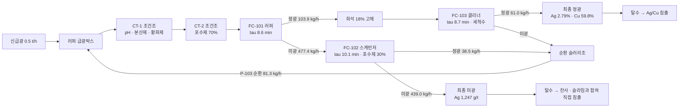
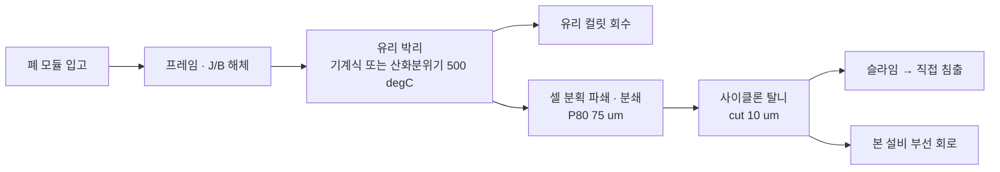

# 태양광 패널 재활용용 부유선별 회로 설계 (러퍼 – 스캐빈저 – 클리너)

**목적** — 폐 태양광 모듈(c-Si)에서 회수된 셀 분획으로부터 **은(Ag)** 과 **구리(Cu)** 를
부유선별로 농축한다.

| 항목 | 값 |
|---|---|
| 구성 | **러퍼 1기 + 스캐빈저 1기 + 클리너 1기 (순환 폐회로)** |
| 평균 처리량 | **0.30 t/h** (건조 고체) |
| 최대 처리량 | **0.50 t/h** (건조 고체) |
| 형식 | 기계식 강제급기 부선셀 (mechanical forced-air, 정사각 단면) |
| Ag 회수율 | **82.4 %** @ 0.30 t/h / **75.7 %** @ 0.50 t/h |
| Cu 회수율 | **93.6 %** / **91.3 %** |
| 정광 Ag 품위 | **2.89 %** (28,900 g/t) / **2.79 %** — 농축비 6.2~6.4배 |
| 정광 Si 함량 | **1.2 %** |
| 정광량 | 38.5 / **61.0 kg/h** (mass pull 12~13 %) |
| 순환부하 | 15~16 % |
| 설치 전력 | 9.74 kW |

전체 수치 계산 과정은 [설계 계산서](design-calculation.md) 에 있고,
그 계산서는 `PYTHONPATH=src python -m flotation_design` 로 코드에서 자동 생성된다.

---

## 1. 설계상 가장 중요한 판단 — "Ag 는 Si 와 결합되어 있다"

Ag 는 스크린 인쇄된 Ag 페이스트(Ag 분말 + 유리프릿)가 800 °C 소성으로 SiNx 반사방지막을
뚫고 Si 에미터에 **소결 접합**된 형태다. 핑거는 폭 30~80 µm, 두께 10~20 µm 로,
분쇄만으로는 완전 해리되지 않는다. 이 사실이 선별 방식 선택을 좌우한다.

| 방식 | Ag-Si 복합입자에 대한 거동 | 판정 |
|---|---|---|
| 비중선별 | 복합입자 겉보기 비중이 Si(2.33)에 가까워 분리 불가 | ✗ |
| 자력/와전류 | Ag 는 비자성, 미립에서 와전류 분리 하한(> 2 mm) 미달 | ✗ |
| **부유선별** | **입자 "표면"의 젖음성으로 분리 — Ag 가 표면에 노출되어 있으면 Si 코어째 부상** | **✓** |
| 직접 침출 | 가능하나 전량(0.5 t/h)을 HNO₃ 로 처리 → 시약비·폐액량 과다 | △ (후단) |

즉 **부유선별의 강점은 완전 해리를 요구하지 않는다는 점**이다. 본 설계는 해리를 전제하지
않고 "Ag 가 표면에 노출된 복합입자의 부상"을 목표로 하며, Ag 가 입자 내부에 완전히
갇힌 분율(약 12 %)은 원리적 회수 한계로 명시했다.

부선의 역할은 "Ag 를 순수하게 뽑는 것"이 아니라 **후단 침출 대상 물량을 1/8 로 줄이는 것**
이다 (500 → 61 kg/h, Ag 농축비 6.2배). 정광에 남는 Si 1.2 % 는 HNO₃ 침출에서
부동태화되어 시약을 소모하지 않는다.

### 입도 설계

| 항목 | 값 | 근거 |
|---|---|---|
| 분쇄 목표 | **P80 = 75 µm** | 핑거 폭(30~80 µm)과 같은 급으로 낮춰 Ag 노출면 확보 |
| 탈니(deslime) 컷 | **10 µm** | 미립은 기포 부착확률이 급감하고 맥석 혼입을 키움 |
| 슬라임 처리 | 별도 직접 침출 | 부선으로 회수 불가한 Ag 를 버리지 않기 위함 |

과분쇄는 금물이다. 10 µm 이하로 가면 Ag 회수율이 오히려 떨어진다.

---

## 2. 왜 3단인가 — 속부선/지연부선/비부선

같은 Ag 라도 부상 속도가 제각각이다. Ag 노출면이 큰 입자는 빠르게, 소결 접합면이 겨우
드러난 복합입자는 느리게 부상하고, Si 내부에 갇힌 Ag 는 아예 부상하지 않는다.
설계는 성분마다 이 3분획을 구분한 **Kelsall 형 2속도 모델**로 계산했다.

| Ag 분획 | 비율 | k (1/min) | 의미 |
|---|---|---|---|
| 속부선 | 55 % | 1.20 | Ag 노출면이 넓은 입자 — 러퍼에서 대부분 잡힌다 |
| 지연부선 | 33 % | 0.12 | 접합면만 겨우 드러난 복합입자 — **스캐빈저의 대상** |
| 비부선 | 12 % | — | Si 내부에 완전 봉입 — 원리적으로 회수 불가 |

이 구분이 없으면 설계가 성립하지 않는다. 단일 속도상수 모델은 러퍼 미광에 남은 물질이
러퍼 급광과 같은 속도로 부상한다고 가정하므로 **스캐빈저 회수율을 크게 과대평가한다.**
실제 러퍼 미광은 속부선 분획이 이미 빠져나간 뒤라 지연부선·비부선 위주이며, 러퍼 미광의
Ag 를 잡으려면 러퍼보다 긴 체류시간(10.1분)과 신선한 포수제가 필요하다.

각 단의 역할은 이렇게 갈린다.

| 단 | 대상 | 목표 | 운전 방향 |
|---|---|---|---|
| **러퍼** FC-101 | 신급광 + 순환류 | 속부선 분획을 최대한 빨리 회수 | 표준 |
| **스캐빈저** FC-102 | 러퍼 미광 | 지연부선 분획을 끝까지 긁어냄 (**회수율**) | 거품층 얕게, 급기 많이, 포수제 추가 |
| **클리너** FC-103 | 러퍼 정광 | 동반 맥석(Si)을 씻어냄 (**품위**) | 거품층 깊게, 급기 적게, 세척수 |

---

## 3. 회로 구성



유량은 최대 처리량(0.5 t/h) 기준.

**순환류 처리 원칙** — 스캐빈저 정광과 클리너 미광은 모두 "중간 품위" 물질이므로 최종
산물로 내보내지 않고 러퍼 급광으로 되돌린다. 순환부하는 16.3 % 로, 러퍼 급광이
581 kg/h 까지 늘어난다. 러퍼 체류시간이 Phase 1 의 9.9분에서 8.6분으로 내려가지만
이는 스캐빈저가 있는 러퍼의 정상적인 duty 다.

---

## 4. 상류 공정 전제



> **열처리는 반드시 산화 분위기로 완전 연소시킬 것.** 무산소 열분해는 EVA 를
> 탄화물(char)로 남기는데, char 는 본질적으로 소수성이라 약제 없이도 전량 부상한다.
> 계산서에서 `Polymer` 성분 회수율이 89 % 로 나오고 정광의 17 % 를 차지하는 것이
> 이 리스크다. **클리너도 이것만은 못 씻어낸다** — 진부선으로 올라오는 것이라
> 세척수로 제거되지 않기 때문이다. 잔류 유기물이 2 % 를 넘으면 정광 품위가 무너지므로,
> 상류 열처리의 TOC 관리가 본 회로 성능의 전제조건이다.

---

## 5. 셀별 설계

### 5.1 공통 사양

| 항목 | 사양 |
|---|---|
| 형식 | 정사각 단면 기계식 강제급기 부선셀, 상부 개방 |
| 재질 | STS304 t5.0, 외부 보강 앵글 50×50×5 |
| 마모 대책 | 바닥~300 mm 및 로터 주변 **폴리우레탄 라이닝 t10** — Si·유리는 Mohs 6~7 로 매우 마모성이 큼 |
| 로터/스테이터 | **PU 피복 교체형**, 스테이터 외경 1.35 D, 반경방향 간극 10 mm |
| 축봉 | 그리스 라비린스 + 슬링거 |
| 액면 제어 | 다트밸브 + 초음파 액면계 PID |
| 부속 | 코너 배플 4개, 바닥 드레인 밸브, 정광 크라우더, 샘플 포트 3점 |

### 5.2 FC-101 러퍼

| 항목 | 사양 |
|---|---|
| 내부 치수 | 700 × 700 × 810 mm(H), 유효 슬러리 체적 0.281 m³ |
| 운전 액면 / 거품층 | 750 mm / **75 mm** |
| 체류시간 | 8.6 min @ 최대 (14.4 min @ 평균) |
| 로터 | Ø240 mm, 440 rpm, 주속 5.53 m/s |
| 모터 | 2.2 kW 4P IE3 + VFD, V벨트 3.3:1 |
| 급기 | Jg 1.0 cm/s = 17.6 m³/h, Sb 50 s⁻¹ |
| 런더 | 양측 2면, 폭 150 mm, 구배 3° |

Phase 1 에서 확정한 셀을 **치수 변경 없이 그대로** 쓴다.

### 5.3 FC-102 스캐빈저

| 항목 | 사양 |
|---|---|
| 내부 치수 | **러퍼와 동일 동체** 700 × 700 × 810 mm(H) |
| 운전 액면 / 거품층 | 750 mm / **50 mm** (얕게 — 회수 우선) |
| 유효 슬러리 체적 | 0.292 m³ (거품층이 얕아 러퍼보다 큼) |
| 체류시간 | 10.1 min @ 최대 (17.0 min @ 평균) |
| 로터 / 모터 | Ø240 mm, 440 rpm / 2.2 kW — **러퍼와 동일** |
| 급기 | Jg **1.2 cm/s** = 21.2 m³/h, Sb **60 s⁻¹** (러퍼보다 20 % 증량) |
| 약제 | 급광박스에 PAX 35 g/t + 3418A 12 g/t + MIBC 10 g/t **분할 투입** |

**러퍼와 동일 동체로 설계한 것이 핵심 결정이다.** 계산상 필요 체적(0.289 m³)이
러퍼(0.281 m³)와 거의 같아 자연스럽고, 동체·로터·스테이터·구동부·예비품을 전부
공용화할 수 있다. 두 셀은 사실상 러퍼-스캐빈저 뱅크(직렬 2기)를 이룬다.

운전은 정반대로 간다 — 거품층을 얕게(50 mm) 가져가 부착된 입자를 최대한 넘기고,
급기를 늘려 기포 표면적을 키운다. 품위는 신경 쓰지 않는다. 어차피 정광은 러퍼로
되돌아가기 때문이다.

### 5.4 FC-103 클리너

| 항목 | 사양 |
|---|---|
| 내부 치수 | 450 × 450 × 620 mm(H), 유효 슬러리 체적 0.073 m³ |
| 운전 액면 / 거품층 | 560 mm / **150 mm** (깊게 — 배수 유도) |
| 기공률 | 12 % (러퍼·스캐빈저 15 %) |
| 체류시간 | 8.7 min @ 최대 |
| 로터 | Ø160 mm, 540 rpm, 주속 **4.52 m/s** (완만하게) |
| 모터 | **0.55 kW** 4P + VFD |
| 급기 | Jg **0.6 cm/s** = 4.4 m³/h, Sb 30 s⁻¹ |
| 급광 희석 | **18 wt% 고체**로 희석 (러퍼 정광은 32 % 로 진함) |
| 거품 세척수 | **0.25 m³/h** 스프레이 바 (양수 bias) |
| 약제 | 규산소다 100 g/t 보강. **기포제는 넣지 않는다** |

클리너의 설계 논리는 러퍼·스캐빈저와 전부 반대다.

- **깊은 거품층(150 mm)** — 거품이 립까지 올라가는 동안 동반된 물이 아래로 배수되고,
  그 물에 딸려 올라온 Si·유리가 함께 떨어진다.
- **낮은 급기(0.6 cm/s)와 완만한 로터(4.5 m/s)** — 기포를 적게, 크게 만들어 선택성을
  높이고 미립 복합입자의 이탈을 줄인다.
- **거품 세척수** — 거품층 위에서 아래로 흘려 동반 맥석을 씻어 내린다. 이것이 정광
  Si 를 24.2 % → **1.2 %** 로 떨어뜨리는 주역이다.
- **급광 희석** — 러퍼 정광을 그대로 넣으면 거품이 무거워지고 동반 혼입이 커진다.
- **기포제 금지** — 거품이 질겨지면 배수가 되지 않아 클리닝 자체가 성립하지 않는다.

폭 450 mm 는 체류시간이 아니라 **제작·운전상 실용 하한**(거품 안정성, 런더 접근,
다트밸브 크기)으로 결정했다. 필요 체적은 0.067 m³ 로 더 작게도 가능하지만
그 크기의 셀은 거품이 서지 않는다.

### 5.5 정광 배출 부하 검토 (최대 유량)

| 셀 | Froth carry rate | Lip loading | 판정 |
|---|---|---|---|
| FC-101 | 0.212 t/h/m² | 0.074 t/h/m | OK (한계의 14 %) |
| FC-102 | 0.079 t/h/m² | 0.027 t/h/m | OK (5 %) |
| FC-103 | 0.301 t/h/m² | 0.068 t/h/m | OK (20 %) |

한계(1.5 t/h/m², 1.5 t/h/m) 대비 여유가 크다. 셀 크기를 결정한 것은 배출 능력이 아니라
**체류시간**이며, 이는 미립·저품위 급광 부선기의 전형적인 지배 인자다.

### 5.6 조건조 및 부대 기기

| 기기 | 역할 | 사양 |
|---|---|---|
| CT-1 | pH + 분산/억제제 + 황화제 (5 min) | Ø596 × 716 mm, 0.20 m³, 교반 0.37 kW |
| CT-2 | 포수제 70 % (3 min) | Ø542 × 650 mm, 0.15 m³, 교반 0.37 kW |
| P-101 | 급광 펌프 | 0.75 kW |
| P-103 | **순환 슬러리 펌프** (스캐빈저 정광 + 클리너 미광 → 러퍼 급광박스) | 0.75 kW, 거품 대응형 |
| P-105 | 최종 정광 이송 | 0.55 kW |
| B-101 | **공용 송풍기** 59 m³/h × 30 kPa, 분기 3계통 | 1.5 kW 측류형 |

조건조는 **순환류를 포함한** 러퍼 급광 유량(최대 1.973 m³/h) 기준으로 산정했다.

러퍼·스캐빈저는 0.8 m 가대 위에 설치해 러퍼 정광이 클리너로 자연유하하게 한다.
순환류만 펌프(P-103) 1대로 반송한다. 송풍기는 3기 공용 1대에 분기별 유량계·제어밸브를
두는 편이 개별 송풍기 3대보다 싸고 관리가 쉽다.

---

## 6. 분리 화학 (약제 계통)

금속 Ag·Cu 표면은 그 자체로는 잔티에이트 흡착이 약하다. **황화(sulfidization)** 로
표면을 Ag₂S / CuS 로 전환한 뒤 티올계 포수제를 흡착시킨다.
투입량은 모두 **신급광 t 당** 기준이다 (순환류 제외).

| 단계 | 약제 | 총 투입량 | 투입 지점 | 펌프 (최대) |
|---|---|---|---|---|
| pH 조정 | Na₂CO₃ (소다회) | 800 g/t | CT-1 | 3.64 L/h |
| 분산·억제 | 규산소다 (modulus 2.4) | 400 + 100 g/t | CT-1 / FC-103 | 1.85 + 0.46 L/h |
| 황화 | Na₂S·9H₂O | 350 g/t | CT-1 (분할) | 1.62 L/h |
| 포수 (주) | PAX | **85 g/t CT-2 + 35 g/t FC-102** | 분할 투입 | 2.12 + 0.88 L/h |
| 포수 (보조) | Dithiophosphinate (3418A 상당) | **28 + 12 g/t** | 분할 투입 | 1.39 + 0.59 L/h |
| 기포 | MIBC (1 % 수용액) | **20 g/t FC-101 + 10 g/t FC-102** | 분할 투입 | 1.00 + 0.50 L/h |

### 왜 분할 투입인가

포수제를 러퍼에 한꺼번에 넣으면 두 가지가 동시에 나빠진다. 러퍼에서는 포수제 과잉으로
맥석까지 부상해 정광 품위가 무너지고, 스캐빈저에서는 이미 소모된 포수제가 남아 있지
않아 지연부선 분획이 부상하지 못한다. 그래서 러퍼에 70 %, 스캐빈저 급광박스에 30 %
를 나눠 넣는다. 계산 모델에서는 이 효과를 스캐빈저의 지연부선 속도상수에 곱하는
계수 1.4(`SCAVENGER_COLLECTOR_BOOST`)로 반영했고, 이 값은 배치 부선시험(단계별 약제
추가)으로 확정해야 한다.

**황화제는 과잉이 곧 억제다.** 정량 투입이 아니라 ORP 피드백으로 조절해야 하며,
이것이 본 설비에서 가장 중요한 제어 루프다.

**분할 투입으로 1회 투입량이 작아진 약제는 조제 농도를 낮춰야 한다.** 3418A 는
5 % 로 조제하면 스캐빈저 분할분이 0.07 L/h 까지 떨어져 정량펌프 제어 범위를 벗어난다.
1 % 로 조제해 0.59 L/h 를 확보했다.

---

## 7. 계장 및 제어

| 태그 | 계측/제어 | 설정 | 동작 |
|---|---|---|---|
| LIC-101/102/103 | 셀별 펄프 액면 | 거품층 75 / 50 / 150 mm | PID → 다트밸브 (80A / 80A / 50A) |
| FIC-111/112/113 | 셀별 급기 유량 | Jg 1.0 / 1.2 / 0.6 cm/s | PID → 분기 제어밸브 |
| SIC-121/122/123 | 로터 회전수 | 440 / 440 / 540 rpm | VFD |
| AIC-104 | **pH** (CT-1 출구) | 9.0~9.5 | PID → Na₂CO₃ 정량펌프 |
| AIC-105 | **ORP** (CT-1 출구, Ag/AgCl) | −450~−520 mV | PID → Na₂S 정량펌프 |
| FIC-106 | 신급광 유량 (전자유량계) | — | 약제 정량펌프 10대 비례 제어의 기준값 |
| DIC-107 | 러퍼 급광 밀도 | **25 wt%** | 희석수 밸브 |
| DIC-108 | 클리너 급광 밀도 | **18 wt%** | 희석수 밸브 |
| FIC-109 | 클리너 거품 세척수 | 0.25 m³/h | 정유량 제어 |
| LIC-110 | 순환 슬러리조 액면 | — | P-103 VFD |
| ASH-201 | **H₂S 검지기** (셀 상부 + 약제실) | 10 ppm 경보 / 20 ppm 정지 | §8 인터록 |

### 순환 회로 특유의 제어 포인트

- **순환부하 감시** — P-103 유량 × 밀도로 순환 고체량을 계산해 트렌드로 감시한다.
  설계값 16 % 에서 30 % 를 넘어가면 클리너가 과부하이거나 러퍼 약제가 부족하다는
  신호다. 방치하면 회로가 "부풀어" 러퍼 체류시간이 무너진다.
- **순환 슬러리조 액면** — 순환류는 거품 산물이라 공기를 물고 들어온다. 조를 크게
  잡고(체류 3분 이상) 소포 배플을 두어 펌프 캐비테이션을 막는다.
- **기동 순서** — 회로가 정상 순환부하에 도달하기까지 약 30분(체류시간의 2~3배)이
  걸린다. 기동 직후 30분간은 정광을 별도 조에 받았다가 정상화 후 합류시킨다.

### 인터록

1. **pH < 8.5 → Na₂S 정량펌프 즉시 정지 + 경보** (H₂S 발생 방지, 최우선)
2. H₂S 20 ppm → 약제 정량펌프 전량 정지, 배기팬 기동, 급광 정지
3. 셀 액면 HH → 해당 셀 상류 급광 정지
4. 로터 VFD 트립 → 해당 셀 급기 정지 + 상류 급광 정지 + 침전 방지 드레인 절차
5. **P-103 정지 → 신급광 정지** (순환류가 끊기면 러퍼 물수지가 깨진다)
6. 급광 정지 5 분 경과 → 약제 정량펌프 자동 정지

---

## 8. 안전

| 위험 | 원인 | 대책 |
|---|---|---|
| **H₂S 중독** | Na₂S + 산성 슬러리 | pH 하한 인터록(§7-1), H₂S 검지기 2점, 셀 상부 국소배기, 밀폐공간 작업 절차 |
| **CS₂ (잔티에이트 분해)** | PAX 수용액 경시 분해, 저 pH | 2 % 이하로 매일 신규 조제, pH 9 이상 유지, 약제실 환기 6 ACH, 화기 금지 |
| **Si 분진 폭발** | 건조 미분 Si (가연성 분진) | **전 공정 습식 취급**, 정광·미광 함수율 15 % 이상 유지, 건조기 사용 시 불활성화 |
| **Pb 노출** | 땜납(Sn/Pb) 리본 — 정광에 8.2 % 로 농축됨 | 습식 취급, 정광 취급 시 호흡보호구, 작업자 혈중 납 정기검진 |
| **회전체** | 로터 축 3기 | 커플링 커버, 인터록 도어, LOTO |
| **고가 정광** | Ag 2.79 % 정광 | 정광 배출부 시건, 교대별 계량·정산 |

---

## 9. 물질수지 (최대 0.50 t/h 기준)

| 성분 | 신급광 (kg/h) | 최종 정광 (kg/h) | 최종 미광 (kg/h) | 회로 회수율 | 정광 품위 |
|---|---|---|---|---|---|
| Si | 310.00 | 0.76 | 309.24 | 0.2 % | 1.25 % |
| Glass | 90.00 | 0.18 | 89.82 | 0.2 % | 0.30 % |
| Cu | 40.00 | 36.53 | 3.47 | 91.3 % | 59.83 % |
| Al | 40.00 | 6.39 | 33.61 | 16.0 % | 10.47 % |
| **Ag** | **2.25** | **1.70** | **0.55** | **75.7 %** | **2.79 %** |
| SnPb | 6.00 | 4.98 | 1.02 | 83.0 % | 8.15 % |
| Polymer | 11.75 | 10.51 | 1.24 | 89.4 % | 17.21 % |
| **합계** | **500.0** | **61.0** (12.2 %) | **439.0** | | |

단위 셀별로 보면 이렇다.

| 셀 | 급광 (kg/h) | 체류시간 | mass pull | Ag 회수율 |
|---|---|---|---|---|
| FC-101 러퍼 | 581.3 | 8.55 min | 17.9 % | 65.8 % |
| FC-102 스캐빈저 | 477.4 | 10.11 min | 8.1 % | 53.4 % |
| FC-103 클리너 | 103.9 | 8.68 min | 58.8 % | 75.3 % |

클리너의 Ag 회수율 75.3 % 는 **손실이 아니다.** 나머지 24.7 % 는 클리너 미광으로
러퍼에 되돌아가 다시 기회를 얻는다. 회로에서 Ag 가 실제로 빠져나가는 곳은
스캐빈저 미광 한 군데뿐이다 (0.55 kg/h, 1,247 g/t).

평균 0.30 t/h 운전 시에는 모든 셀의 체류시간이 1.7배로 늘어 Ag 82.4 %, Cu 93.6 %
로 개선된다.

---

## 10. 러퍼 단독 대비 효과와 단계별 구축

| 지표 (최대 유량) | 러퍼 단독 | 3단 회로 | 차이 |
|---|---|---|---|
| Ag 회수율 | 70.7 % | **75.7 %** | +4.9 %p |
| Cu 회수율 | 84.8 % | **91.3 %** | +6.5 %p |
| 정광 Ag 품위 | 1.88 % | **2.79 %** | 1.48배 |
| **정광 Si 함량** | **24.2 %** | **1.2 %** | **−22.9 %p** |
| 정광량 (후단 침출 부하) | 84.6 kg/h | **61.0 kg/h** | −28 % |
| Ag 선별효율 (Newton) | 54.1 % | **63.7 %** | +9.7 %p |

**회수율 이득(+4.9 %p)보다 품위 이득이 훨씬 크다.** 정광의 Si 가 24.2 % 에서 1.2 %
로 떨어지면서 침출 반응조 크기, 시약 소요량, 여과 부하, 폐액량이 모두 함께 줄어든다.
스캐빈저·클리너의 투자 회수는 회수율이 아니라 **후단 습식제련 설비의 축소**에서 나온다.

### 단계별 구축

러퍼 셀은 두 구성에서 치수가 동일하므로 나눠 지을 수 있다.

| 단계 | 범위 | 성능 | 추가 투자 |
|---|---|---|---|
| **Phase 1** | FC-101 + CT-1/2 + 송풍기 | Ag 70.7 %, 정광 Si 24.2 % | 기준 |
| **Phase 2** | + FC-102 스캐빈저 | Ag 회수율 개선 | 러퍼와 동일 동체 (설계 유용) |
| **Phase 3** | + FC-103 클리너 + 순환 펌프 | 정광 Si 1.2 % | 소형 셀 1기 + 펌프 1대 |

Phase 1 만으로도 운전은 가능하다. 다만 송풍기는 처음부터 3기 공용 용량(59 m³/h)으로,
가대와 배관 랙은 3기 배치로 잡아 두어야 증설 시 재공사가 없다.

---

## 11. 시운전 및 성능 확인 계획

계산에 쓰인 2속도 모델 파라미터(분획 비율, `k_fast`, `k_slow`)와
`SCAVENGER_COLLECTOR_BOOST` 는 **문헌 기반 가정값**이다. 설비 제작 전에 반드시
실험실 시험으로 확정해야 한다.

| 단계 | 시험 | 산출물 |
|---|---|---|
| 1 | 실제 급광 시료 조성·입도 분석, Ag 부존형태(SEM-EDS) 확인 | `design_basis.CELL_FRACTION` 갱신 |
| 2 | **1 L 배치 부선시험, 정광 시간별 분취 (1·2·4·8·16·30분)** | 성분별 회수율-시간 곡선을 2속도 모델로 회귀 → 분획 비율과 `k_fast`/`k_slow` 확정 |
| 3 | **러퍼 미광 재부선 시험** (포수제 추가 유무 비교) | 스캐빈저 duty 와 `SCAVENGER_COLLECTOR_BOOST` 확정 |
| 4 | **러퍼 정광 클리닝 시험** (세척수량 · 거품층 두께 변수) | 클리너 `water_recovery`, 세척수량 확정 |
| 5 | 록사이클(locked-cycle) 시험 6사이클 | 순환부하 수렴값과 회로 회수율 실측 검증 |
| 6 | 코드 재실행 → 체적·회전수·급기량 재확정 | 갱신된 계산서 |
| 7 | 실기 72시간 연속 시운전 (0.3 / 0.4 / 0.5 t/h) | 성능 보증 |

**5단계 록사이클 시험이 특히 중요하다.** 순환류가 있는 회로는 배치 시험 결과를
단순 합산해서는 예측할 수 없다. 본 계산의 순환부하 16 % 와 회로 회수율은 록사이클
시험으로 검증해야 하는 값이다.

### 성능 보증값 (제안)

| 항목 | 보증값 | 조건 |
|---|---|---|
| Ag 회수율 | ≥ 72 % | 급광 0.5 t/h, P80 75 µm, 잔류 유기물 ≤ 2 % |
| Cu 회수율 | ≥ 88 % | 동일 |
| 정광 Ag 품위 | ≥ 2.4 % | 동일 |
| 정광 Si 함량 | ≤ 3 % | 동일 |
| 정광 mass pull | ≤ 15 % | 동일 |
| 순환부하 | ≤ 25 % | 동일 |
| 가동률 | ≥ 95 % | 계획정비 제외 |

---

## 12. 유틸리티 및 배치

| 항목 | 값 |
|---|---|
| 로터 구동 3기 | 2.2 + 2.2 + 0.55 = 4.95 kW |
| 송풍기 (공용 1대) | 1.5 kW |
| 조건조 교반기 | 0.74 kW |
| 펌프 (급광·순환·정광) | 2.05 kW |
| 약제 정량펌프 10대 | 0.5 kW |
| **설치 전력 합계** | **9.74 kW** |
| 상시 소비 전력 | 약 5.0 kW |
| 신수 소요량 | 1.66 m³/h (거품 세척수 0.25 포함, 회수수 사용 시 10 % 블리드) |
| 급기 | 59 m³/h @ 30 kPa |
| 최종 정광 | 61.0 kg/h @ 18.0 wt% |
| 최종 미광 | 439.0 kg/h @ 24.1 wt% |
| 스키드 소요 면적 | 약 4.0 × 2.0 m (셀 3기 + 조건조 2기, 약제 스키드 별도) |
| 소요 높이 | 약 3.0 m (0.8 m 가대 + 셀 + 모터) |

---

## 13. 코드로 재계산하기

패키지가 `src/` 레이아웃이므로 설치 없이 실행할 때는 `PYTHONPATH=src` 를 붙인다
(`pip install -e .` 로 설치했다면 `flotation-design` 으로 바로 실행).

```bash
PYTHONPATH=src python -m flotation_design                               # 회로 계산서 표준출력
PYTHONPATH=src python -m flotation_design -o docs/design-calculation.md # 파일로 저장
PYTHONPATH=src python -m flotation_design --peak-tph 0.6                # 처리량 변경
python -m unittest discover -s tests -t .                               # 검증
```

`--average-tph` / `--peak-tph` 는 **재사이징이 아니라 확정 셀의 성능 계산**이다.
셀 치수를 바꾸려면 `design_basis.py` 의 확정 치수 상수를 직접 고쳐야 한다.
확정 셀이 목표 체류시간에 미달하면 계산서 상단에 경고가 붙고, §9 에 그 처리량에
필요한 셀 치수가 함께 표시된다.

설계 전제(급광 조성, 셀 형상, 약제, 2속도 모델 파라미터, 순환 조건)는 모두
`src/flotation_design/design_basis.py` 한 곳에 있다. 시험 결과가 나오면 이 파일만
갱신하고 재실행하면 셀 치수부터 순환부하·약제 소요량까지 일관되게 다시 계산된다.
